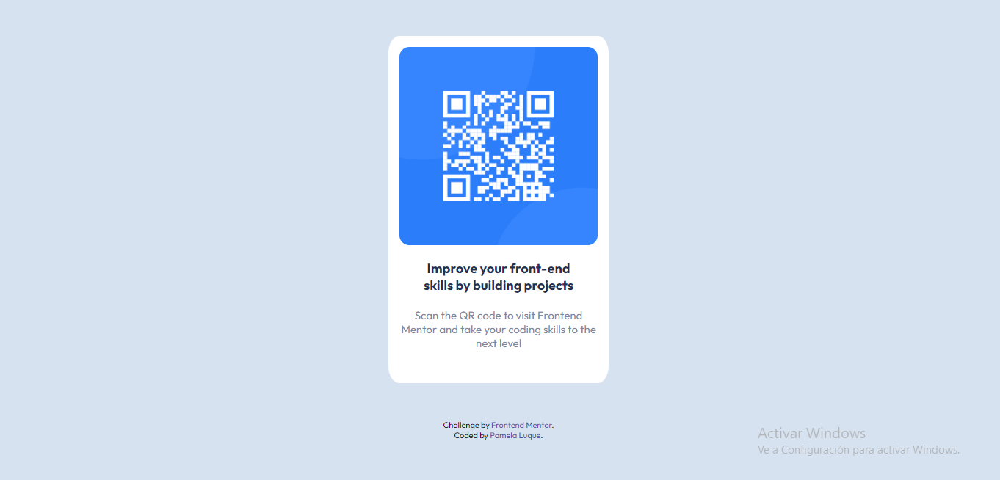

# Frontend Mentor - QR code component solution

This is a solution to the [QR code component challenge on Frontend Mentor](https://www.frontendmentor.io/challenges/qr-code-component-iux_sIO_H). 

## Table of contents

- [Overview](#overview)
  - [Screenshot](#screenshot)
  - [Links](#links)
- [My process](#my-process)
  - [Built with](#built-with)
  - [What I learned](#what-i-learned)
  - [Continued development](#continued-development)
- [Author](#author)

## Overview

### Screenshot

### Links

- Solution URL: [Add solution URL here](https://your-solution-url.com)
- Live Site URL: [Add live site URL here](https://your-live-site-url.com)

## My process

### Built with

- Semantic HTML5 markup
- CSS custom properties
- Flexbox
- Mobile-first workflow

### What I learned

Really it was simple at first time. I started with mobile-first and I had to readapt "width" for "max-with" to achieve a responsive page.

### Continued development

I would to develop more efficiently the concept of mobile-first workflow. With practice I will be more comfortable to do my best quickly in future projects. It was a good challenge for me!

## Author

- Website - [PAMELA LUQUE](https://github.com/pamelaluque)
- Frontend Mentor - [@pamelaluque](https://www.frontendmentor.io/profile/pamelaluque)

